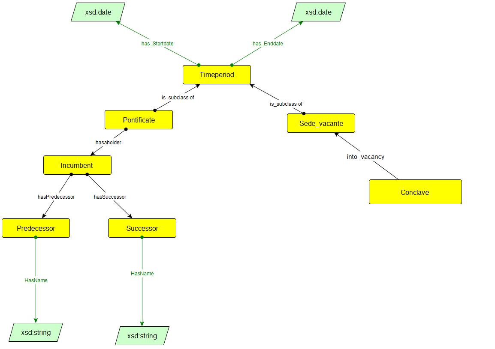

## Ontology description

Model for vacancy of holy see and papacy and associated time periods.

| Web Ontology Language      | Bedeutung |Standard |
| ------------------| ----------- |----------- |
| owl:Class         | A group of individuals that belong together because they share some properties       | Class |
| owl:NamedIndividual| Instances of classes.      | Indiviual        |
| owl:ObjectProperty | Relations between pairs of individuals.  | Relation        |
| owl:DataProperty   | Relations between individuals and data values.   | Attribute        |
| rdfs:domain  | A domain of a property limits the individuals to which the property can be applied. | Domain        |
| rdfs:range   | The range of a property limits the individuals that the property may have as its value. | Range        |

## Ontology

 | CLASS             | LABEL       |description | super class  | sub class|
| ------------------| ----------- |----------- |-------------|--------- |
| dioc:TimePeriod       | TimePeriod      |An identifiable and named period of time. An interval.|Pontificate, Sede_vacante ||
| dioc:Pontificate       | Pontificate      |An identifiable and named period of time. An interval.|Pontificate, Sede_vacante ||
| dioc:Sede_vacante       | Sede_vacante      |expression in Catholic and Anglican canon law referring to an episcopal vacancy.|||
| dioc:Predecessor        | predecessor       |entity which is followed by another one in a sequence or order|||
| dioc:Successor        | Successor       |entity which follows another one in a sequence or order.|||
| dioc:Incumbent         | Incumbent       |	current holder of a office|||
| dioc:Conclave         | Conclave       |	meeting to elect a pope|||

- Object property

| OBJECT PROPERTY   | LABEL       |DOMAIN  |RANGE  |
| ------------------| ----------- |----------- |-------------|
| Into Vacancy  	 	  | into_vacancy          |dioc:Conclave| dioc:Sede_vacante|

- Data property

| DATA PROPERTY     | LABEL       |DOMAIN | RANGE  |
| ------------------| ----------- |----------- |---|
| dioc:HasName       | HasName     |dioc:Predecessor, dioc:Successor| xsd:string|
| dioc:has_Startdate       | has_Startdate     |dioc:TimePeriod| xsd:date|
| dioc:has_Enddate       | has_Enddate     |dioc:TimePeriod| xsd:date|
